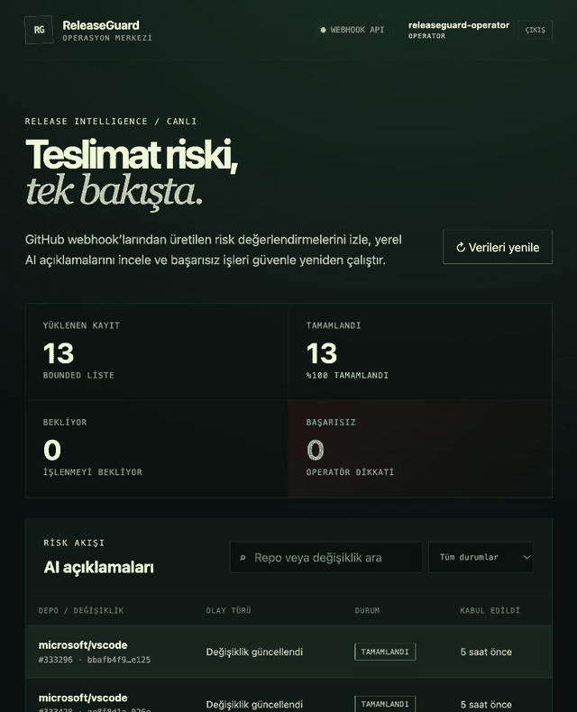
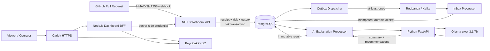

# ReleaseGuard AI

ReleaseGuard AI, GitHub pull request değişikliklerini güvenli ve dayanıklı bir olay hattından geçirerek açıklanabilir sürüm riski üreten bir yazılım teslimat platformu prototipidir.

Proje; imzalı GitHub webhook kabulü, deterministik risk puanlama, PostgreSQL transactional outbox, Kafka/Redpanda taşıması, idempotent inbox, Ollama tabanlı yerel yapay zekâ açıklaması, Keycloak kimlik doğrulaması ve operatör dashboard'unu tek bir uçtan uca akışta birleştirir.

> Mevcut sürüm GitHub `pull_request` olaylarının `opened` ve `synchronize` action'larını işler. Ham kaynak kod diff'i, CI sonucu veya gerçek deployment kararı henüz risk girdisi değildir.

## Demo



GIF, tam yerel Compose yığınında çalışan Keycloak korumalı dashboard'u gösterir. Ekrandaki `microsoft/vscode` kayıtları public GitHub PR metadata'sıyla yerel imzalı webhook → PostgreSQL → Kafka → inbox → Ollama hattının uçtan uca doğrulanmasından alınmıştır; GitHub'ın doğrudan gönderdiği production teslimatları değildir.

## İçindekiler

- [Demo](#demo)
- [Neler sunuyor?](#neler-sunuyor)
- [Mimari](#mimari)
- [Nasıl çalışır?](#nasıl-çalışır)
- [Risk modeli](#risk-modeli)
- [Teknoloji yığını](#teknoloji-yığını)
- [Yerelde çalıştırma](#yerelde-çalıştırma)
- [GitHub webhook bağlantısı](#github-webhook-bağlantısı)
- [API yüzeyi](#api-yüzeyi)
- [Güvenlik ve dayanıklılık](#güvenlik-ve-dayanıklılık)
- [Testler](#testler)
- [Production Compose](#production-compose)
- [Bilinen sınırlar](#bilinen-sınırlar)
- [Dokümantasyon](#dokümantasyon)

## Neler sunuyor?

| Alan | Tamamlanan özellik |
| --- | --- |
| GitHub kabulü | Ham request body üzerinde `X-Hub-Signature-256` doğrulaması, delivery GUID idempotency ve `opened` / `synchronize` desteği |
| Risk değerlendirme | Dosya genişliği, satır hareketi ve hedef dal üzerinden deterministik `0–100` skor ve açıklanabilir faktörler |
| Kalıcı kabul | Webhook receipt, risk snapshot'ı ve outbox mesajının tek PostgreSQL transaction'ında yazılması |
| Olay taşıma | Kalıcı claim/lease, bounded retry ve crash recovery kullanan transactional outbox → Kafka/Redpanda akışı |
| Consumer | Manuel offset commit, exact payload karşılaştırması ve durable-accept-then-commit kullanan idempotent inbox |
| Yapay zekâ | Ücretli API anahtarı gerektirmeyen Ollama + `qwen3:1.7b` ile Türkçe veya İngilizce risk açıklaması |
| AI yaşam döngüsü | Pending/claim/retry/completed/terminal failure durumları, capped backoff ve değişmez sonuçlar |
| Sorgulama | Tek event, bounded keyset listeleme ve açıkça `latestAccepted` olarak adlandırılmış repository/change görünümü |
| Replay | Ayrı credential ve bütçe ile yalnız terminal başarısız işleri yeni, değişmez generation olarak yeniden çalıştırma |
| Kimlik | Keycloak OIDC Authorization Code + PKCE, RS256/JWKS doğrulaması ve viewer/operator rol ayrımı |
| Dashboard | Server-side BFF üzerinden liste, detay, AI önerileri ve operator-only replay arayüzü |
| Koruma | Credential rotation, sabit-zamanlı karşılaştırma, endpoint-local rate limit, bounded timeout ve cancellation ayrımı |
| Gözlemlenebilirlik | Düşük kardinaliteli OpenTelemetry query sayaçları ve DB read latency ölçümü |
| Bakım | Bağımlılıkları koruyan bounded retention cleanup ve V001–V008 ileri yönlü migration zinciri |
| Dağıtım | Tam yerel Docker Compose ve Caddy TLS kullanan tek Linux sunuculu, non-HA production Compose profili |

## Mimari



Production profilinde yalnız Caddy'nin `80/443` portları dışarı açılır. PostgreSQL, Redpanda, Ollama, Python AI servisi ve .NET read/replay uçları internal Docker ağında kalır. Browser hiçbir zaman query/replay service credential'ını veya OIDC access token'ını almaz.

## Nasıl çalışır?

1. GitHub bir pull request açıldığında veya head branch'e yeni commit geldiğinde webhook gönderir.
2. API imzayı JSON'u ayrıştırmadan önce ham byte dizisi üzerinde doğrular.
3. Delivery GUID, repository, PR numarası, branch'ler ve değişiklik büyüklüğü dar bir risk girdisine dönüştürülür.
4. Deterministik değerlendirici risk skorunu ve puana katkı veren faktörleri üretir.
5. Delivery, risk snapshot'ı ve outbox envelope'u aynı PostgreSQL transaction'ında kalıcılaştırılır.
6. Dispatcher mesajı Kafka'ya yayınlar; consumer exact V1 envelope'u inbox'a yazdıktan sonra offset'i commit eder.
7. AI processor kayıtlı skoru değiştirmeden Ollama'dan insan-okunur özet ve öneriler alır; sonuç dashboard'da gösterilir.

Bu tasarım "exactly once" iddiasında bulunmaz. Taşıma at-least-once çalışır; tekrarlar delivery GUID, event ID, exact payload constraint'leri ve idempotent PostgreSQL kabulüyle güvenli biçimde sonlandırılır.

## Risk modeli

İlk risk modeli yan etkisiz ve deterministiktir. Aynı girdi her zaman aynı skoru üretir.

| Sinyal | Koşul | Puan | Faktör |
| --- | ---: | ---: | --- |
| Değişiklik genişliği | `5–19` dosya | `+15` | `wider_change` |
| Değişiklik genişliği | `20+` dosya | `+30` | `broad_change` |
| Satır hareketi | `200–999` satır | `+20` | `elevated_change_churn` |
| Satır hareketi | `1000+` satır | `+50` | `high_change_churn` |
| Hedef dal | `main` veya `master` | `+20` | `primary_target_branch` |

| Toplam skor | Seviye |
| ---: | --- |
| `0–29` | `low` |
| `30–64` | `medium` |
| `65–100` | `high` |

Ollama bu skoru yeniden hesaplamaz. Model yalnız kayıtlı skor, seviye ve faktörleri açıklayan bir özet ile öneri listesi üretir.

## Teknoloji yığını

- **Backend:** .NET 8, ASP.NET Core Minimal API, Npgsql
- **AI servisi:** Python, FastAPI, Pydantic, HTTPX
- **Yerel model:** Ollama, varsayılan `qwen3:1.7b`
- **Veritabanı:** PostgreSQL 16
- **Olay akışı:** Kafka uyumlu Redpanda
- **Kimlik:** Keycloak OIDC
- **Dashboard:** Node.js 22, server-side BFF, vanilla HTML/CSS/JavaScript
- **Edge:** Caddy, otomatik ACME TLS ve güvenlik header'ları
- **Telemetry:** OpenTelemetry OTLP
- **Test:** xUnit, Testcontainers, pytest, Node test runner
- **Çalıştırma:** Docker Compose

## Yerelde çalıştırma

### Önkoşullar

- Docker Engine veya Docker Desktop
- Docker Compose v2
- İlk image ve model indirmesi için internet bağlantısı

Kaynak kod testlerini Docker dışında çalıştırmak isterseniz ayrıca .NET 8 SDK, Python 3.9+ ve Node.js 22+ gerekir.

### 1. Depoyu klonlayın

```bash
git clone https://github.com/enesbabaoglu/ReleaseGuardAI.git
cd ReleaseGuardAI
```

### 2. Yerel secret'ları üretin

```bash
export RELEASEGUARD_POSTGRES_PASSWORD="$(openssl rand -hex 32)"
export RELEASEGUARD_GITHUB_WEBHOOK_SECRET="$(openssl rand -hex 32)"
export RELEASEGUARD_QUERY_CREDENTIAL="$(openssl rand -hex 32)"
export RELEASEGUARD_REPLAY_CREDENTIAL="$(openssl rand -hex 32)"
export RELEASEGUARD_KEYCLOAK_ADMIN_USERNAME='releaseguard-admin'
export RELEASEGUARD_KEYCLOAK_ADMIN_PASSWORD="$(openssl rand -hex 32)"
export RELEASEGUARD_KEYCLOAK_LOCAL_USERNAME='releaseguard-operator'
export RELEASEGUARD_KEYCLOAK_LOCAL_PASSWORD="$(openssl rand -hex 32)"
```

Bu değerler yalnız mevcut shell oturumunda tutulur; repoya yazılmaz.

### 3. Bütün sistemi başlatın

```bash
docker compose config --quiet
docker compose up --build --wait
docker compose ps
```

İlk başlangıçta Ollama image'ı ve model blob'u indirilir. Süre ağ bağlantısına ve bilgisayar donanımına göre değişir.

### 4. Dashboard'u açın

- Dashboard: <http://localhost:3000>
- Keycloak: <http://localhost:8180>
- Webhook API health: <http://localhost:8080/health>
- AI service health: <http://localhost:8090/health>
- Ollama: <http://localhost:11434/api/tags>

Dashboard girişinde `RELEASEGUARD_KEYCLOAK_LOCAL_USERNAME` ve `RELEASEGUARD_KEYCLOAK_LOCAL_PASSWORD` değerlerini kullanın.

### 5. Sistemi durdurun

Veriyi ve indirilen modeli koruyarak:

```bash
docker compose down
```

Container'larla birlikte bütün yerel PostgreSQL, Redpanda, Keycloak ve Ollama volume'larını da silmek için:

```bash
docker compose down --volumes --remove-orphans
```

Son komut geri alınamaz ve yalnız silinebilir yerel geliştirme verisi için kullanılmalıdır.

## GitHub webhook bağlantısı

Gerçek bir repository webhook'u için GitHub'da `Settings → Webhooks → Add webhook` ekranını kullanın:

| Ayar | Değer |
| --- | --- |
| Payload URL | `https://YOUR_DOMAIN/webhooks/github` |
| Content type | `application/json` |
| Secret | `github_webhook_secret` dosyanızdaki yüksek entropili değer |
| Events | Yalnız `Pull requests` |
| Active | Açık |

Uygulama bugün yalnız `pull_request/opened` ve `pull_request/synchronize` action'larını risk girdisine dönüştürür. Diğer doğrulanmış event/action'lar `ignored` olarak kalıcılaştırılır.

GitHub yerel `localhost` adresine ulaşamaz. Gerçek webhook demosu için production profiliyle public HTTPS domain kullanın; local geliştirmede imzalı fixture veya kontrollü bir tunnel gerekir.

## API yüzeyi

| Metot ve route | Amaç | Koruma |
| --- | --- | --- |
| `GET /health` | API sağlık kontrolü | Public |
| `POST /webhooks/github` | GitHub delivery kabulü | HMAC-SHA256 |
| `GET /v1/release-risk-events/{eventId}/ai-explanation` | Tek event durumu/sonucu | Query credential + rate limit |
| `GET /v1/release-risk-events/ai-explanations` | Bounded keyset listeleme | Query credential + rate limit |
| `GET /v1/repositories/{owner}/{repository}/changes/{changeNumber}/ai-explanation/latest-accepted` | Son kabul edilen snapshot | Query credential + rate limit |
| `POST /v1/release-risk-events/{eventId}/ai-explanation/replays` | Terminal sonucu yeni generation olarak replay | Replay credential + ayrı rate limit |
| `POST /v1/release-risk-explanations` | Dahili Python AI açıklama sözleşmesi | Internal network |

Production Caddy yalnız dashboard, `/identity/*` ve exact `/webhooks/github` yolunu dışarı açar. Read/replay API'leri dashboard BFF arkasında internal kalır.

## Güvenlik ve dayanıklılık

### Webhook güvenliği

- İmza, GitHub'ın gönderdiği ham gövde üzerinde HMAC-SHA256 ile doğrulanır.
- Digest karşılaştırması sabit zamanlıdır.
- Eksik, bozuk veya yanlış imza iş verisi ayrıştırılmadan reddedilir.
- Delivery GUID PostgreSQL primary key'i olduğu için eşzamanlı redelivery yarışları da idempotenttir.

### Dashboard ve kimlik

- Keycloak Authorization Code + PKCE akışı kullanılır.
- ID token; issuer, audience, nonce, süre ve RS256/JWKS imzasıyla doğrulanır.
- Browser'da opaque `HttpOnly`, `Secure`, `SameSite=Lax` session cookie tutulur.
- Viewer salt-okunur; replay yalnız operator rolüne açıktır.
- Replay ve logout mutasyonları CSRF token gerektirir.
- Backend service credential'ları browser JavaScript'ine gönderilmez.

### Credential ve trafik sınırları

- Query ve replay farklı credential kullanır.
- Active/previous credential çifti kesintisiz rotation sağlar.
- Credential özetleri sabit-zamanlı karşılaştırılır.
- Read ve replay bütçeleri global, bounded ve credential kimliğinden bağımsızdır.
- `401` authentication sonucu rate-limit bütçesinden önce gelir.
- `429` yanıtı stabil problem body ve bounded `Retry-After` üretir.

### Kalıcılık

- Webhook kabulü ve outbox insert'i tek transaction'dır.
- Kafka publish sonrası acknowledgement alınmadan outbox tamamlanmış sayılmaz.
- Inbox commit edilmeden Kafka offset ilerletilmez.
- Başarılı ve terminal AI sonuçları yerinde değiştirilmez.
- Replay yeni generation oluşturur ve audit geçmişini korur.
- Retention işi pending/claimed/unpublished taşıma kayıtlarını veya replay history'yi silmez.

## Testler

Son tam doğrulama sonucu:

| Paket | Sonuç |
| --- | ---: |
| .NET unit + PostgreSQL/Redpanda/Uvicorn integration | `323/323` |
| Python API/provider/settings/contract | `56/56` |
| Node dashboard/OIDC/BFF/production Compose | `16/16` |
| **Toplam** | **`395/395`** |

### .NET

```bash
dotnet format ReleaseGuard.sln
dotnet restore ReleaseGuard.sln --disable-build-servers -m:1
dotnet build ReleaseGuard.sln --no-restore --disable-build-servers -m:1
dotnet test ReleaseGuard.sln --no-build --disable-build-servers -m:1
```

Integration testleri gerçek PostgreSQL 16 ve Redpanda container'ları kullanır; Docker kapalıyken sessizce başarılı sayılmaz.

### Python

```bash
cd src/ReleaseGuard.AiExplanation.Api
python -m pip install -e '.[test]'
python -m ruff check .
python -m ruff format --check .
python -m compileall -q releaseguard_ai tests
python -m pytest
```

### Dashboard

```bash
cd src/ReleaseGuard.Dashboard
npm run check
npm test
npm run build
```

Dashboard harici npm paketi kullanmadığı için `npm install` gerektirmez.

## Production Compose

`compose.production.yml`, local Compose'un override'ı değildir. Tek Linux sunucuda küçük ve kontrollü demo/production kullanımı için ayrı bir profildir.

Başlangıç kapasitesi olarak en az 4 vCPU, 16 GiB RAM ve yedeklenen SSD önerilir. Gerçek DNS adı sunucuya yönelmeli; inbound `80/tcp`, `443/tcp` ve HTTP/3 için `443/udp` açık olmalıdır.

### Özet başlangıç

```bash
cp deploy/production/production.env.example deploy/production/production.env
chmod 600 deploy/production/production.env
```

`production.env` içinde gerçek domain, ACME e-postası, bootstrap admin adı ve model seçilir. Altı bağımsız secret dosyası `deploy/production/secrets/` altında `0600` izinle üretilir.

```bash
node scripts/validate-production-compose.mjs \
  --env-file deploy/production/production.env \
  --check-secrets

docker compose \
  --env-file deploy/production/production.env \
  -f compose.production.yml \
  build --pull

docker compose \
  --env-file deploy/production/production.env \
  -f compose.production.yml \
  up --detach --wait
```

İlk production kullanıcısı interaktif olarak oluşturulur:

```bash
bash scripts/provision-production-keycloak-user.sh \
  deploy/production/production.env \
  releaseguard-operator
```

Eksiksiz DNS, secret üretimi, firewall, kullanıcı provision, health, backup, restore, upgrade ve rollback adımları için [production işletim rehberini](deploy/production/OPERATIONS.md) izleyin.

## Dizin yapısı

```text
ReleaseGuardAI/
├── src/
│   ├── ReleaseGuard.WebhookIngestion.Api/   # .NET API, workers ve PostgreSQL migrations
│   ├── ReleaseGuard.AiExplanation.Api/      # FastAPI ve Ollama adapter'ı
│   └── ReleaseGuard.Dashboard/              # Node.js BFF ve operator UI
├── tests/
│   └── ReleaseGuard.WebhookIngestion.Api.Tests/
├── deploy/
│   ├── local/                               # Keycloak realm ve OTLP collector
│   └── production/                          # Caddy, production realm ve runbook
├── scripts/                                 # Contract, preflight ve provisioning araçları
├── docs/                                    # Ayrıntılı mühendislik notları
├── compose.yml                              # Tam yerel geliştirme yığını
├── compose.production.yml                   # Tek sunuculu non-HA profil
└── ReleaseGuard.sln
```

## Bilinen sınırlar

- Sistem ham diff veya kaynak kod içeriğini analiz etmez; PR metadata ve değişiklik büyüklüğüyle çalışır.
- Ollama açıklaması yardımcı metindir. Deterministik skoru değiştiremez ve insan onayının yerine geçmez.
- Küçük `qwen3:1.7b` modeli bazen tekrarlı, yüzeysel veya istenen dilden farklı metin üretebilir.
- Local Compose geliştirme içindir; HTTP, seeded kullanıcı ve internal PLAINTEXT bileşenler production güvenlik modeli değildir.
- Production Compose tek host, tek broker ve tek replica kullanır; HA veya zero-downtime sağlamaz.
- Dashboard session store ve rate limiter'lar process belleğindedir; birden fazla instance için ortak kota/session garantisi yoktur.
- Production runtime PostgreSQL kimliği bugün startup migration için DDL yetkisi taşır; migration/runtime least-privilege ayrımı sıradaki güvenlik checkpoint'idir.
- Monitoring backend, otomatik off-host backup, SMTP/MFA, WAF ve multi-node Kafka bu repository tarafından kurulmaz.

## Dokümantasyon

- [Ayrıntılı mühendislik kararları ve doğrulama geçmişi](docs/ENGINEERING-NOTES.md)
- [Tek sunuculu production işletim rehberi](deploy/production/OPERATIONS.md)
- [Production environment örneği](deploy/production/production.env.example)

## Proje durumu

Webhook → PostgreSQL → outbox → Kafka → inbox → Ollama → immutable sonuç → Keycloak korumalı dashboard zinciri tamamlanmış ve gerçek container'larla uçtan uca doğrulanmıştır.

Sıradaki dar teknik adım, migration sahibini uzun yaşayan runtime PostgreSQL kullanıcısından ayırarak least-privilege veritabanı yetkilendirmesini tamamlamaktır.
